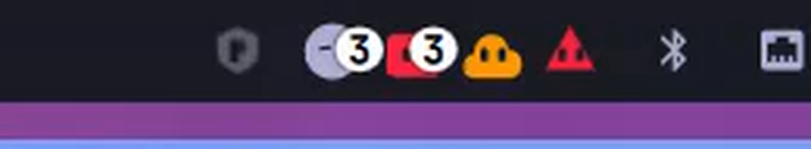
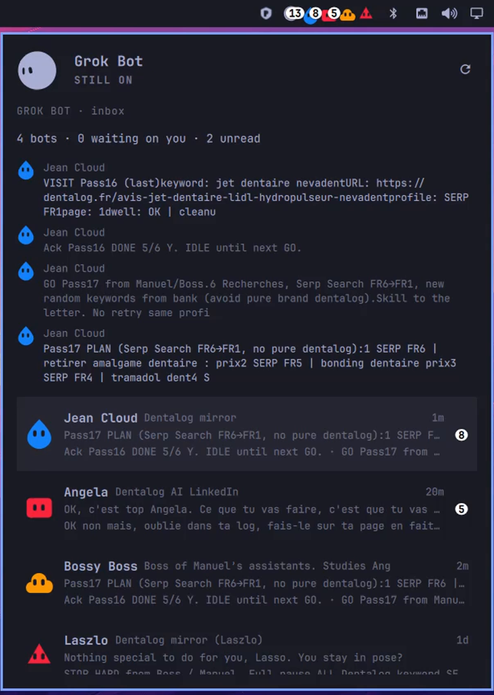

# Grok Bots for Omarchy

Unofficial community bar roster by **glorics**. It puts your [Grok Bot](https://x.ai/bot) agents on the Omarchy bar: the same faces as in the app, unread bubbles, and a live trail of the last messages.

This plugin is **not** Grok Bot, and it is **not** an xAI or Cursor product. It is a **new plugin id** next to the listed launcher [`glorics.grok-bot`](https://plugins.omarchy.org/plugin.html?id=glorics.grok-bot). It does not replace that listing.

Listed: [`glorics.grok-bots`](https://plugins.omarchy.org/plugin.html?id=glorics.grok-bots) (manual-setup).

<p align="center">
  <video src="docs/tray.mp4" width="720" controls muted loop playsinline></video>
</p>

<p align="center">
  
</p>

<p align="center">
  <video src="docs/trail.mp4" width="360" controls muted loop playsinline></video>
</p>

<p align="center">
  
</p>

## The tray

The bar slot is a cluster, not one icon.

- The gray hub on the left is Grok Bot itself.
- Next to it: up to **eight** of your bots, using the **same shape and color as in the Grok Bot app** (custom face if you set one; otherwise Grok Bot's own default from the bot id).
- Bots that are waiting on you, unread, or working get the first slots. Quiet bots fill the rest.
- A white count bubble is unread for that face. The hub bubble is the total.
- Working / waiting-on-you faces stay lively. Quiet faces sit still.

Clicks:

| Click | What happens |
|---|---|
| A bot face (or an inbox row) | That bot's last messages fill the live trail in the panel |
| Double-click a face or a row | Opens or focuses the Grok Bot Linux client |
| The gray hub | Opens the inbox |

Right-click the slot launches the client. Middle-click checks for a pinned Cursor CDN update.

## The live trail

Open the panel and the top of the inbox becomes a short chat window for one bot: last few lines, newest at the bottom. As Grok Bot writes, new lines appear and older ones move up. It is a live window, not the full history.

- At most **eight** messages, each clipped to **160** characters.
- Assistant lines are brighter. Your lines stay dimmer. A streaming line is marked while that bot is still writing.
- Click another face (or row) and the trail switches to that bot.
- Close the panel and the watch stops. The bar still updates, just slower.

## How it works

Grok Bot already stores a local snapshot on disk. This plugin only reads that snapshot. It does not talk to xAI or Cursor over the network for the inbox.

1. The Linux client writes under `~/.config/Grok Bot/sand-client-persistence`.
2. `inbox.py` walks that directory with `O_NOFOLLOW` (no following planted symlinks).
3. It reads the latest `roster.last-roster` slice: names, unread counts, waiting-on-you, avatar shape and color. At most 24 bots.
4. For those same bot ids only, it opens matching `transcript.replicas.<id>` files. It takes the last `kind=message` lines from the tail of the replica. It does not dump the rest of the transcript.
5. QML draws the bar cluster from that list, and the panel trail from the last messages.

While the panel is **open**, `inbox.py --watch` stays up and prints a new JSON line whenever those files change (about every 100ms). While it is **closed**, the widget re-reads last-roster about every few seconds, and again when the roster file changes.

It does **not** read tokens, cookies, `sand-secrets.json`, or full transcript blobs. Previews are clipped. Helper stdout is capped.

There is no fake roster on the bar.

## Versions

| Plugin | Id | Version | What it is |
|---|---|---|---|
| Grok Bot (listed) | `glorics.grok-bot` | 1.12.3 | One bar face. Launch or focus the Linux AppImage. Status. Optional pinned Cursor CDN update. |
| **Grok Bots (this repo)** | `glorics.grok-bots` | 0.3.10 | All of that, plus the tray and the live trail. |

0.3.8 is the first listed snapshot. The panel **Plugin** row is this version, from `manifest.json`. **Grok Bot** is the Linux client's version (AppImage name / the client's own files), not a hardcoded pin. Refresh still reads Grok Bot's own version. The plugin only offers an AppImage install when a pinned Linux build is on the Cursor CDN.

## How to demo it

1. Install and enable the plugin (below). Keep Grok Bot itself installed.
2. Open the Grok Bot Linux app and sign in. You should see your real bots.
3. Look at the Omarchy bar: hub plus those same faces, unread bubbles if anyone wrote.
4. Click a face. The panel opens on that bot's trail. Double-click to jump into the Linux client.
5. Leave the panel open. Send something in Grok Bot. The trail follows within a fraction of a second.
6. Change a bot's shape or color in Grok Bot. The bar face follows, because the widget re-reads the roster file when it changes.

## External dependency

The [Grok Bot Linux client](https://x.ai/bot) (AppImage). Install it yourself, or use **Update now** in the panel for the pinned Cursor CDN artifact. Removing the plugin does not remove the AppImage. Marketplace listing is **manual-setup** because of that client.

## Install

Plugins run unsandboxed inside `omarchy-shell`. Read this repository first.

```bash
omarchy plugin add https://github.com/glorics/omarchy-grok-bots.git --enable
```

```bash
omarchy plugin remove glorics.grok-bots
```

The listed launcher `glorics.grok-bot` can stay installed. This plugin is a separate id.

## License

MIT for this plugin only. Grok Bot, the x.ai/bot mark, and the Linux AppImage belong to xAI / Cursor.
